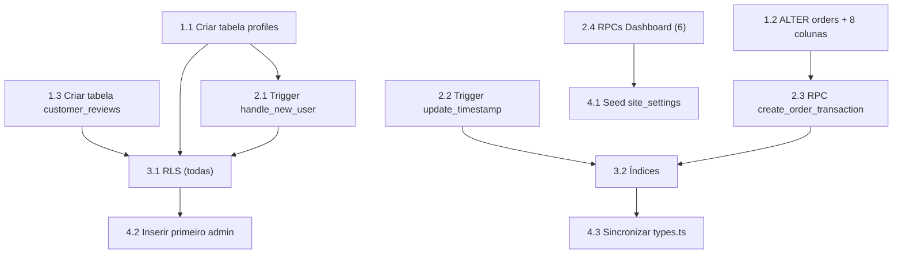

# FASE 1 — Sincronização Completa do Supabase

## Objetivo

Alinhar o banco Supabase real (`mjnsfkivjbfpxedydtkn`) com o schema esperado pelo código front-end, **sem perder os dados existentes** (7 produtos, 4 banners, 6 categorias, 3 coleções, ~49 imagens no storage, 2 site_settings).

## Contexto da Auditoria

| Recurso | Código Espera | Supabase Real | Gap |
|---------|:---:|:---:|:---:|
| Tabelas | 11 | 9 | **-2** (`profiles`, `customer_reviews`) |
| Colunas em `orders` | 31 | 23 | **-8** |
| RPCs | 8 | 1 | **-7** |
| Triggers | 3+ | ~1 | **-2+** |
| Storage bucket | 1 | 1 (conteúdo OK) | ✅ |

---

## Mapa de Dependências



---

## Wave 1 — Tabelas e Colunas Faltantes

> **Pré-requisito:** Acesso ao Supabase Dashboard → SQL Editor
> **Risco:** BAIXO — apenas operações `CREATE TABLE` e `ALTER TABLE ADD COLUMN` (não destrutivas)

### Task 1.1 — Criar tabela `profiles`

<read_first>
- supabase/migrations/00000000000000_initial_schema.sql (linhas 72-80)
</read_first>

<action>
Executar no SQL Editor do Supabase:

```sql
-- 1.1 Criar tabela profiles
CREATE TABLE IF NOT EXISTS profiles (
    id UUID PRIMARY KEY REFERENCES auth.users(id) ON DELETE CASCADE,
    name TEXT NOT NULL DEFAULT '',
    cpf TEXT,
    phone TEXT,
    created_at TIMESTAMPTZ DEFAULT NOW(),
    updated_at TIMESTAMPTZ DEFAULT NOW()
);

-- Habilitar RLS imediatamente (policy será criada na Wave 3)
ALTER TABLE profiles ENABLE ROW LEVEL SECURITY;
```
</action>

<acceptance_criteria>
- `SELECT count(*) FROM profiles` retorna 0 (sem erro)
- `\d profiles` mostra colunas: id, name, cpf, phone, created_at, updated_at
- RLS está habilitado (`SELECT relrowsecurity FROM pg_class WHERE relname = 'profiles'` retorna `true`)
</acceptance_criteria>

<risks>
- **Se existirem usuários em `auth.users` sem profile:** O trigger da Task 2.1 só cria profiles para NOVOS usuários. Profiles retroativos para usuários existentes precisam de INSERT manual.
- **Rollback:** `DROP TABLE IF EXISTS profiles CASCADE;`
</risks>

---

### Task 1.2 — Adicionar 8 colunas faltantes em `orders`

<read_first>
- supabase/migrations/00000000000000_initial_schema.sql (linhas 121-153)
- Relatório de auditoria: colunas existentes vs faltantes
</read_first>

<action>
Executar no SQL Editor do Supabase:

```sql
-- 1.2 Adicionar colunas faltantes em orders
ALTER TABLE orders ADD COLUMN IF NOT EXISTS payment_gateway TEXT;
ALTER TABLE orders ADD COLUMN IF NOT EXISTS payment_gateway_id TEXT;
ALTER TABLE orders ADD COLUMN IF NOT EXISTS transaction_id TEXT;
ALTER TABLE orders ADD COLUMN IF NOT EXISTS pix_code TEXT;
ALTER TABLE orders ADD COLUMN IF NOT EXISTS pix_qrcode TEXT;
ALTER TABLE orders ADD COLUMN IF NOT EXISTS paid_at TIMESTAMPTZ;
ALTER TABLE orders ADD COLUMN IF NOT EXISTS webhook_payload JSONB;
ALTER TABLE orders ADD COLUMN IF NOT EXISTS external_reference TEXT;
```
</action>

<acceptance_criteria>
- `SELECT payment_gateway, payment_gateway_id, transaction_id, pix_code, pix_qrcode, paid_at, webhook_payload, external_reference FROM orders LIMIT 0` executa sem erro
- Todas as 8 colunas são nullable (não quebram registros existentes)
- `SELECT count(*) FROM orders` continua retornando 0 (sem side effects)
</acceptance_criteria>

<risks>
- **Risco ZERO:** `ADD COLUMN IF NOT EXISTS` é idempotente e não afeta dados existentes
- **Rollback:** `ALTER TABLE orders DROP COLUMN <nome>;` para cada coluna
</risks>

---

### Task 1.3 — Criar tabela `customer_reviews`

<read_first>
- supabase/migrations/00000000000000_initial_schema.sql (linhas 211-223)
</read_first>

<action>
Executar no SQL Editor do Supabase:

```sql
-- 1.3 Criar tabela customer_reviews
CREATE TABLE IF NOT EXISTS customer_reviews (
    id UUID PRIMARY KEY DEFAULT gen_random_uuid(),
    order_id UUID REFERENCES orders(id) ON DELETE SET NULL,
    product_id UUID REFERENCES products(id) ON DELETE SET NULL,
    customer_name TEXT NOT NULL,
    customer_photo TEXT,
    rating INTEGER NOT NULL CHECK (rating >= 1 AND rating <= 5),
    comment TEXT NOT NULL,
    city TEXT,
    state TEXT,
    approved BOOLEAN DEFAULT FALSE,
    created_at TIMESTAMPTZ DEFAULT NOW()
);

ALTER TABLE customer_reviews ENABLE ROW LEVEL SECURITY;
```
</action>

<acceptance_criteria>
- `SELECT count(*) FROM customer_reviews` retorna 0 (sem erro)
- Constraint de rating funciona: `INSERT INTO customer_reviews (customer_name, rating, comment) VALUES ('Teste', 6, 'x')` deve falhar
- FK para orders e products funciona
</acceptance_criteria>

<risks>
- **Risco BAIXO:** Tabela nova, sem dados para perder
- **Rollback:** `DROP TABLE IF EXISTS customer_reviews CASCADE;`
</risks>

---

## Wave 2 — Triggers, Functions e RPCs

> **Pré-requisito:** Wave 1 completa (tabelas existem)
> **Risco:** MÉDIO — functions PL/pgSQL podem ter erros de sintaxe

### Task 2.1 — Trigger `handle_new_user` + Function

<read_first>
- supabase/migrations/00000000000000_initial_schema.sql (linhas 266-287)
</read_first>

<action>
Executar no SQL Editor do Supabase:

```sql
-- 2.1 Function e trigger para auto-criar profile ao registrar usuário
CREATE OR REPLACE FUNCTION handle_new_user()
RETURNS TRIGGER
LANGUAGE plpgsql
SECURITY DEFINER
SET search_path = public
AS $func$
BEGIN
    INSERT INTO public.profiles (id, name, cpf, phone)
    VALUES (
        NEW.id,
        COALESCE(NEW.raw_user_meta_data->>'name', ''),
        NEW.raw_user_meta_data->>'cpf',
        NEW.raw_user_meta_data->>'phone'
    );
    RETURN NEW;
END;
$func$;

-- Remover trigger existente (se houver) e recriar
DROP TRIGGER IF EXISTS on_auth_user_created ON auth.users;
CREATE TRIGGER on_auth_user_created
    AFTER INSERT ON auth.users
    FOR EACH ROW
    EXECUTE FUNCTION handle_new_user();
```
</action>

<acceptance_criteria>
- `SELECT proname FROM pg_proc WHERE proname = 'handle_new_user'` retorna 1 registro
- `SELECT tgname FROM pg_trigger WHERE tgname = 'on_auth_user_created'` retorna 1 registro
- Ao criar um novo usuário via Supabase Auth (Dashboard > Auth > Add User), um registro aparece em `profiles`
</acceptance_criteria>

<risks>
- **Se `profiles` não existir:** Trigger falhará silenciosamente em cada signup → executar APÓS Task 1.1
- **Rollback:** `DROP TRIGGER IF EXISTS on_auth_user_created ON auth.users; DROP FUNCTION IF EXISTS handle_new_user() CASCADE;`
</risks>

---

### Task 2.2 — Function `update_timestamp` + Triggers de updated_at

<read_first>
- supabase/migrations/00000000000000_initial_schema.sql (linhas 289-338)
</read_first>

<action>
Executar no SQL Editor do Supabase:

```sql
-- 2.2 Function genérica de updated_at
CREATE OR REPLACE FUNCTION update_timestamp()
RETURNS TRIGGER
LANGUAGE plpgsql
AS $func$
BEGIN
    NEW.updated_at = NOW();
    RETURN NEW;
END;
$func$;

-- Triggers de updated_at para todas as tabelas que possuem a coluna
CREATE OR REPLACE TRIGGER update_profiles_updated_at
    BEFORE UPDATE ON profiles FOR EACH ROW EXECUTE FUNCTION update_timestamp();

CREATE OR REPLACE TRIGGER update_categories_updated_at
    BEFORE UPDATE ON categories FOR EACH ROW EXECUTE FUNCTION update_timestamp();

CREATE OR REPLACE TRIGGER update_products_updated_at
    BEFORE UPDATE ON products FOR EACH ROW EXECUTE FUNCTION update_timestamp();

CREATE OR REPLACE TRIGGER update_orders_updated_at
    BEFORE UPDATE ON orders FOR EACH ROW EXECUTE FUNCTION update_timestamp();

CREATE OR REPLACE TRIGGER update_hero_banners_updated_at
    BEFORE UPDATE ON hero_banners FOR EACH ROW EXECUTE FUNCTION update_timestamp();

CREATE OR REPLACE TRIGGER update_homepage_categories_updated_at
    BEFORE UPDATE ON homepage_categories FOR EACH ROW EXECUTE FUNCTION update_timestamp();

CREATE OR REPLACE TRIGGER update_homepage_collections_updated_at
    BEFORE UPDATE ON homepage_collections FOR EACH ROW EXECUTE FUNCTION update_timestamp();

CREATE OR REPLACE TRIGGER update_site_settings_updated_at
    BEFORE UPDATE ON site_settings FOR EACH ROW EXECUTE FUNCTION update_timestamp();
```
</action>

<acceptance_criteria>
- `SELECT count(*) FROM pg_trigger WHERE tgname LIKE 'update_%_updated_at'` retorna 8
- Ao fazer `UPDATE products SET name = name WHERE id = (SELECT id FROM products LIMIT 1)`, a coluna `updated_at` muda
</acceptance_criteria>

---

### Task 2.3 — RPC `create_order_transaction`

<read_first>
- supabase/migrations/00000000000000_initial_schema.sql (linhas 442-532)
</read_first>

<action>
Executar no SQL Editor do Supabase o bloco completo da RPC `create_order_transaction` conforme migration (linhas 442-532), incluindo os `GRANT EXECUTE` ao final.
</action>

<acceptance_criteria>
- `SELECT proname FROM pg_proc WHERE proname = 'create_order_transaction'` retorna 1 registro
- Chamar via PostgREST: `POST /rest/v1/rpc/create_order_transaction` com params válidos retorna JSON com `id` e `order_number`
</acceptance_criteria>

<risks>
- **MÉDIO:** Essa RPC faz INSERT em orders + order_items + UPDATE em products.stock dentro de uma transaction. Se falhar em qualquer ponto, faz rollback automático.
- **Dependência:** Requer as 8 colunas novas de orders (Task 1.2)
</risks>

---

### Task 2.4 — RPCs do Dashboard Executivo (6 funções)

<read_first>
- supabase/migrations/00000000000000_initial_schema.sql (linhas 534-771)
</read_first>

<action>
Executar no SQL Editor do Supabase as 6 RPCs em sequência:

1. `get_executive_financial_metrics()` (linhas 534-581)
2. `get_order_funnel()` (linhas 583-617)
3. `get_customer_insights()` (linhas 619-662)
4. `get_product_performance(p_interval TEXT)` (linhas 664-705)
5. `get_sales_chart_data(p_interval TEXT)` (linhas 707-742)
6. `get_dashboard_alerts()` (linhas 744-771)

Cada uma com seus respectivos `GRANT EXECUTE ON FUNCTION ... TO authenticated, service_role;`
</action>

<acceptance_criteria>
- Todas as 6 funções existem: `SELECT proname FROM pg_proc WHERE proname IN ('get_executive_financial_metrics','get_order_funnel','get_customer_insights','get_product_performance','get_sales_chart_data','get_dashboard_alerts')` retorna 6 registros
- `POST /rest/v1/rpc/get_dashboard_alerts` retorna JSON com `low_stock_count`, `pending_orders_count`, etc.
- `POST /rest/v1/rpc/get_product_performance` com `{"p_interval":"month"}` retorna array de produtos
</acceptance_criteria>

---

## Wave 3 — RLS Policies + Índices

> **Pré-requisito:** Waves 1 e 2 completas
> **Risco:** BAIXO — policies são aditivas e não afetam dados existentes

### Task 3.1 — RLS Policies para tabelas novas e existentes

<read_first>
- supabase/migrations/00000000000000_initial_schema.sql (linhas 339-417)
- supabase/migrations/00000000000001_fix_user_roles_rls.sql
</read_first>

<action>
Executar no SQL Editor do Supabase:

```sql
-- 3.1a PROFILES RLS
CREATE POLICY IF NOT EXISTS "profiles_select_own" ON profiles
    FOR SELECT USING (auth.uid() = id OR EXISTS (SELECT 1 FROM user_roles WHERE user_id = auth.uid() AND role = 'admin'));
CREATE POLICY IF NOT EXISTS "profiles_update_own" ON profiles
    FOR UPDATE USING (auth.uid() = id OR EXISTS (SELECT 1 FROM user_roles WHERE user_id = auth.uid() AND role = 'admin'));
-- INSERT é feito pelo trigger SECURITY DEFINER, não precisa de policy

-- 3.1b CUSTOMER_REVIEWS RLS
CREATE POLICY IF NOT EXISTS "customer_reviews_select_approved" ON customer_reviews
    FOR SELECT USING (approved = true OR EXISTS (SELECT 1 FROM user_roles WHERE user_id = auth.uid() AND role = 'admin'));
CREATE POLICY IF NOT EXISTS "customer_reviews_insert_auth" ON customer_reviews
    FOR INSERT WITH CHECK (auth.uid() IS NOT NULL);
CREATE POLICY IF NOT EXISTS "customer_reviews_admin_all" ON customer_reviews
    FOR ALL USING (EXISTS (SELECT 1 FROM user_roles WHERE user_id = auth.uid() AND role = 'admin'));

-- 3.1c FIX: user_roles select own (da migration 00000000000001)
CREATE POLICY IF NOT EXISTS "user_roles_select_own" ON user_roles
    FOR SELECT USING (user_id = auth.uid());
```

> **NOTA:** As demais tabelas (categories, products, orders, etc.) já devem ter RLS policies das migrations originais. Verificar antes de recriar.
</action>

<acceptance_criteria>
- `SELECT schemaname, tablename, policyname FROM pg_policies WHERE tablename IN ('profiles', 'customer_reviews', 'user_roles') ORDER BY tablename, policyname` retorna 5+ policies
- Usuário anônimo consegue fazer SELECT em `customer_reviews` onde `approved = true`
- Usuário autenticado consegue ler seu próprio profile
</acceptance_criteria>

---

### Task 3.2 — Índices para novas tabelas/colunas

<read_first>
- supabase/migrations/00000000000000_initial_schema.sql (linhas 244-261)
</read_first>

<action>
Executar no SQL Editor do Supabase:

```sql
-- 3.2 Índices novos
CREATE INDEX IF NOT EXISTS customer_reviews_product_id_idx ON customer_reviews(product_id);
CREATE INDEX IF NOT EXISTS customer_reviews_approved_idx ON customer_reviews(approved);
CREATE INDEX IF NOT EXISTS customer_reviews_created_at_idx ON customer_reviews(created_at DESC);

-- Índices que podem estar faltando nas tabelas existentes
CREATE INDEX IF NOT EXISTS orders_payment_status_idx ON orders(payment_status);
CREATE INDEX IF NOT EXISTS products_created_at_idx ON products(created_at DESC);
CREATE INDEX IF NOT EXISTS products_active_featured_new_idx ON products(is_active, is_featured, is_new);
```
</action>

<acceptance_criteria>
- `SELECT indexname FROM pg_indexes WHERE tablename = 'customer_reviews'` retorna 3+ índices
- `SELECT indexname FROM pg_indexes WHERE tablename = 'orders' AND indexname LIKE '%payment%'` retorna 1+ índice
</acceptance_criteria>

---

## Wave 4 — Dados Seed, Admin e Sync do Código

> **Pré-requisito:** Waves 1-3 completas
> **Risco:** BAIXO

### Task 4.1 — Seed de dados faltantes em `site_settings`

<action>
Executar no SQL Editor do Supabase:

```sql
-- 4.1 Inserir settings faltantes (sem sobrescrever existentes)
INSERT INTO site_settings (key, value) VALUES
    ('store_data', '{"name": "Nicoly Modas", "phone": "(11) 99999-9999", "email": "contato@nicolymodas.com"}'::JSONB),
    ('general_settings', '{"currency": "BRL", "timezone": "America/Sao_Paulo", "language": "pt-BR"}'::JSONB)
ON CONFLICT (key) DO NOTHING;
```
</action>

<acceptance_criteria>
- `SELECT count(*) FROM site_settings` retorna 4 (instagram, announcement_bar, store_data, general_settings)
</acceptance_criteria>

---

### Task 4.2 — Inserir primeiro admin em `user_roles`

<action>
> ⚠️ **REQUER AÇÃO MANUAL:** O UUID do usuário admin precisa ser obtido em Dashboard > Auth > Users

```sql
-- 4.2 Primeiro admin
-- SUBSTITUIR pelo UUID real do usuário que será admin
INSERT INTO user_roles (user_id, role)
VALUES ('<UUID_DO_USUARIO_ADMIN>', 'admin')
ON CONFLICT DO NOTHING;
```

Se nenhum usuário existir ainda:
1. Criar manualmente em Dashboard > Auth > Add User
2. Copiar o UUID do usuário criado
3. Executar o INSERT acima
</action>

<acceptance_criteria>
- `SELECT count(*) FROM user_roles WHERE role = 'admin'` retorna 1
- Login com o usuário admin mostra menu admin no site
</acceptance_criteria>

---

### Task 4.3 — Sincronizar `types.ts` com o schema real

<read_first>
- src/integrations/supabase/types.ts
</read_first>

<action>
Atualizar o arquivo `src/integrations/supabase/types.ts` para:
1. Adicionar campo `external_reference` nos tipos `Row`, `Insert` e `Update` de `orders`
2. Adicionar a RPC `create_order_transaction` na seção `Functions`
3. Verificar que `user_roles` tem o nome da chave correto (já corrigido no relatório anterior)
</action>

<acceptance_criteria>
- `npx tsc --noEmit` não mostra erros relacionados ao types.ts
- O tipo `orders.Row` inclui `external_reference: string | null`
- A seção `Functions` inclui `create_order_transaction`
</acceptance_criteria>

---

## Riscos e Mitigações

| # | Risco | Probabilidade | Impacto | Mitigação |
|---|-------|:---:|:---:|-----------|
| R1 | Migration SQL com erro de sintaxe | Média | Baixo | Executar cada bloco separadamente no SQL Editor; rollback individual |
| R2 | RLS policies conflitantes com policies existentes | Baixa | Médio | Usar `IF NOT EXISTS` em todas as policies |
| R3 | Trigger `handle_new_user` falha para usuários já existentes | Alta | Baixo | Criar profiles retroativos manualmente via SQL |
| R4 | `SUPABASE_SERVICE_ROLE_KEY` não configurada | Alta | Alto | Obter a chave no Dashboard > Settings > API e descomentar no `.env` |
| R5 | Schema cache do PostgREST não atualiza | Média | Médio | Aguardar ~60s após mudanças ou fazer reload via Dashboard |

---

## Validações Finais (Pós-Execução)

### Checklist Go/No-Go

```
[ ] Tabela profiles existe e aceita inserts
[ ] Tabela customer_reviews existe com check constraint de rating
[ ] Orders tem 31 colunas (23 originais + 8 novas)
[ ] Trigger handle_new_user funciona (criar usuário teste via Auth)
[ ] 8 triggers de update_timestamp existem
[ ] RPC create_order_transaction existe e é callable
[ ] 6 RPCs do dashboard existem e retornam JSON
[ ] RLS policies em profiles, customer_reviews e user_roles
[ ] Índices criados em customer_reviews e orders
[ ] site_settings tem 4 registros
[ ] user_roles tem pelo menos 1 admin
[ ] types.ts sincronizado (tsc --noEmit sem erros de types.ts)
[ ] Dev server inicia sem erros
[ ] Homepage mostra banners, categorias e produtos do Supabase
[ ] Dashboard admin carrega métricas (mesmo que zeradas)
```

### Script de Validação Automatizada

```javascript
// Executar com: node validate-supabase.js
const url = 'https://mjnsfkivjbfpxedydtkn.supabase.co';
const key = '<ANON_KEY>';
const h = { 'apikey': key, 'Authorization': 'Bearer ' + key, 'Content-Type': 'application/json' };

const checks = [
  // Tabelas
  { name: 'profiles', test: () => fetch(`${url}/rest/v1/profiles?select=id&limit=0`, {headers: h}).then(r => r.ok) },
  { name: 'customer_reviews', test: () => fetch(`${url}/rest/v1/customer_reviews?select=id&limit=0`, {headers: h}).then(r => r.ok) },
  { name: 'orders.payment_gateway', test: () => fetch(`${url}/rest/v1/orders?select=payment_gateway&limit=0`, {headers: h}).then(r => r.ok) },
  { name: 'orders.external_reference', test: () => fetch(`${url}/rest/v1/orders?select=external_reference&limit=0`, {headers: h}).then(r => r.ok) },
  // RPCs
  { name: 'rpc:get_dashboard_alerts', test: () => fetch(`${url}/rest/v1/rpc/get_dashboard_alerts`, {method:'POST',headers:h,body:'{}'}).then(r => r.ok) },
  { name: 'rpc:get_order_funnel', test: () => fetch(`${url}/rest/v1/rpc/get_order_funnel`, {method:'POST',headers:h,body:'{}'}).then(r => r.ok) },
  { name: 'rpc:create_order_transaction', test: () => fetch(`${url}/rest/v1/rpc/create_order_transaction`, {method:'POST',headers:h,body:'{}'}).then(r => r.status !== 404) },
];

(async () => {
  for (const c of checks) {
    const ok = await c.test().catch(() => false);
    console.log(`${ok ? '✅' : '❌'} ${c.name}`);
  }
})();
```

---

## Ordem de Execução Resumida

| Passo | Task | SQL a Executar | Depende de |
|:---:|:---:|:---:|:---:|
| 1 | 1.1 | CREATE TABLE profiles | — |
| 2 | 1.2 | ALTER TABLE orders (8x) | — |
| 3 | 1.3 | CREATE TABLE customer_reviews | — |
| 4 | 2.1 | CREATE FUNCTION handle_new_user + TRIGGER | 1.1 |
| 5 | 2.2 | CREATE FUNCTION update_timestamp + 8 TRIGGERS | 1.1 |
| 6 | 2.3 | CREATE FUNCTION create_order_transaction | 1.2 |
| 7 | 2.4 | CREATE FUNCTION x6 (dashboard RPCs) | — |
| 8 | 3.1 | CREATE POLICY x6 (RLS) | 1.1, 1.3 |
| 9 | 3.2 | CREATE INDEX x6 | 1.3 |
| 10 | 4.1 | INSERT site_settings x2 | — |
| 11 | 4.2 | INSERT user_roles (admin) | Auth user exists |
| 12 | 4.3 | Editar types.ts no código | 1.2 completo |

---

*Plano gerado em: 2026-06-12 · Baseado na auditoria Supabase real*
*Próximo passo: `/gsd-execute-phase 1` ou execução manual via SQL Editor*
